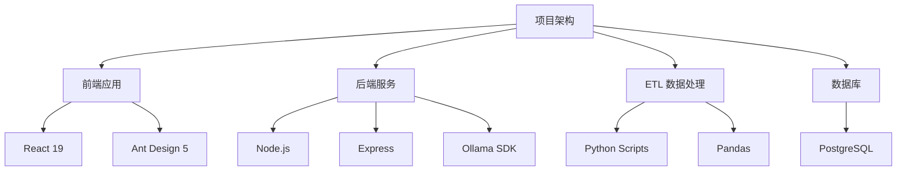

# AI 智能图书馆系统

## 1. 项目概述

AI 智能图书馆（AI-Library）主体是一个具有现代化页面的 Web 应用，旨在将人工智能技术融入传统的图书馆管理和读者服务流程。项目核心是构建一个集图书管理、借阅流程、AI 个性化推荐和 AI 智能问答助手于一体的综合性平台。

此系统不仅提供了标准在线图书馆所需的用户认证、图书检索、借阅管理等基础功能，更通过集成本地大型语言模型（LLM），为用户带来了独特的智能化、个性化阅读体验。管理员则可以通过专属的管理面板，高效地进行用户管理、图书维护、数据导入和数据洞察，从而提升管理效率。

> 项目演示地址: [https://isiou.top](https://isiou.top)
>
> 测试管理员: { "user": "ROOT", "password": "rootuser" }
>
> 测试读者: { "user": "AADM21023", "password": "AADM21023" }

## 2. 需求分析

本项目旨在解决传统图书馆在数字化时代面临的多重挑战：

- 信息过载与发现困难：读者面对海量馆藏，难以快速找到符合个人兴趣和需求的“下一本好书”。
- 服务模式单一：传统的咨询服务依赖人工和读者自行查找，响应速度和知识广度有限，无法满足读者多样化、即时性的信息需求。
- 管理效率低下：图书管理员在数据统计、用户行为分析等方面缺少智能化工具，对馆藏的管理、读者的需求解决仍以经验为主。
- 用户体验不佳：传统图书馆主要依赖于人工，用户需往返于图书馆进行咨询或查询操作，且无法获得对某些问题的解答。

## 3. AI 技术应用方案

为了应对上述挑战，本项目设计了两大核心 AI 功能：**智能推荐系统** 与 **AI 智能助手**。

### 3.1. 智能推荐系统

智能推荐系统是本项目的亮点之一，它采用了一种 **AI 模型与规则引擎混合驱动** 的策略，确保服务的稳定性和高质量。

- **推荐逻辑**：
  1. **数据驱动**：系统首先通过数据库查询获取用户最近的阅读记录，构建基础的用户画像。
  2. **提示词工程**：根据用户的历史偏好和用户提供的 **关键词**，动态构建一个结构化的、高质量的 Prompt。该 Prompt 将指导 AI 模型扮演一位专属于用户的 **经验丰富的图书管理员** 角色。
  3. **AI 模型调用**：后端服务直接与本地部署的 **Ollama** 模型服务进行交互。模型将根据提示词与命令，生成一个专属于读者的、详细的、结构化的推荐列表。
  4. **结果解析与持久化**：后端服务解析大模型返回的数据列表，结构化后在前端进行展示，并将其格式化后持久化保存到用户数据库内，用于后续分析和历史追溯。

- **弹性回退机制**：
  - 为了保证在大模型服务在不可用或响应超时的情况下，推荐功能依然可用，系统设计了弹性回退机制。
  - 当大模型推荐响应失败时，系统会自动降级到 **基于数据库的规则推荐** 逻辑：直接从已入库的数据中查询同类作者或同类题材的书籍作为替代推荐。

### 3.2. AI 智能助手

AI 智能助手为用户提供了一个交互式的聊天界面，能够回答用户关于图书、知识、甚至编程等各类问题。

- **技术实现**：
  1. **会话管理**：后端负责创建和管理用户的聊天会话，并将所有对话历史持久化保存到数据库中。
  2. **模型选择**：支持多种 Ollama 模型（如 `DeepSeek`, `Qwen` 等），后端根据配置调用相应的模型服务。
  3. **流式响应**：为了提供最佳用户体验，后端采用了 **Server-Sent Events (SSE)** 响应模式。当大模型生成回答时，后端会以 **打字机** 的形式，将内容一字一句地实时推送到前端，用户无需等待模型生成完整回答，极大地降低了感知延迟。
  4. **Markdown 渲染**：大模型的回答支持 Markdown 格式，前端能够解析并渲染出格式丰富的文本，如代码块、列表、引用等，提升了信息的可读性与页面的美观性。

## 4. 项目创新点

1.  **本地化 LLM 驱动**：项目主要依赖 **Ollama** 在本地环境中运行开源大语言模型。这不仅显著降低了对商业 API 的依赖和成本，更重要的是保证了用户数据的 **隐私安全** 与 **可扩展性**，所有交互数据均保留在本地服务器内。

    > 另外，由于是基于本地模型，后期若有需要可以进行本地大模型的训练与应用，为图书馆单独训练一个具有 **庞大知识库（如图书资源位置、图书简介、图书馆服务引导等）、应用可行性的专属大模型**。

2.  **混合式推荐引擎**：创造性地结合了 AI 的高级语义理解能力与庞大知识范围，以及传统数据库的稳定性，构建了一个既智能又可靠的推荐系统。

3.  **前后端分离架构**：项目采用经典的前后端分离架构，前端使用最新的 React 技术栈，后端使用成熟的 Express 框架，保证了系统的性能和可维护性。

4.  **自动化数据处理 (ETL)**：引入了独立的 Python ETL 模块，用于处理原始图书数据、清洗读者信息以及生成虚拟借阅记录，为系统提供了高质量的初始化数据和测试环境。

5.  **强可扩展性**：项目的所有结构性、功能性的搭建仍具有非常强的可扩展性，以下列举部分将来可实现的内容。
    - 用户画像：可根据每一位读者或用户的习惯、兴趣，构建独属于用户自己的画像并持久化、可更新地保存下来，用于跟踪用户行为轨迹、阅读偏好、交互频率等多维度特征，从而提供更强大、贴切的个性化推荐与服务。画像系统可结合协同过滤、内容推荐及深度学习模型，实现动态演化与实时更新。
    - 大模型训练：可采用如 PyTorch、TensorFlow 等深度学习框架，根据已有的图书、标签、用户行为等资源构建高质量训练数据集，将数据喂给大语言模型（LLM）或专用模型。通过模型微调或提示词工程，实现智能问答、内容摘要、阅读理解、自动书评生成等功能，进一步提升平台的智能化水平。
    - 离散数据分析：可对用户在平台上的点击流、搜索记录、借阅行为、停留时长等离散事件数据进行采集与建模，利用时间粒度分析、事件挖掘等技术，挖掘潜在行为模式与关联规则。

## 5. 技术路径与架构

项目整体采用三层架构：前端应用、后端服务和数据处理模块，且采用 PostgreSQL 作为存储数据库。

- **前端 (Frontend)**：基于 React 19 和 Vite 构建的 Web 应用，使用 Ant Design 5 作为 UI 组件库，Zustand 进行轻量级状态管理，通过 Axios 与后端进行 API 通信。
- **后端 (Backend)**：基于 Node.js 和 Express 框架构建的 API 服务。负责处理业务逻辑，连接 PostgreSQL 数据库进行查询和存库，并直接调用 Ollama 服务进行 AI 交互。
- **ETL (Extract, Transform, Load)**：独立的 Python 脚本集合，负责数据的清洗、转换和加载，以及虚拟数据的生成，确保系统有充足的测试数据。

## 6. 技术栈

- **前端**：
  - **框架**: React 19
  - **构建工具**: Vite
  - **UI 库**: Ant Design 5
  - **状态管理**: Zustand
  - **路由**: React Router v7
  - **HTTP 请求**: Axios

- **后端**：
  - **框架**: Node.js / Express.js
  - **数据库**: PostgreSQL
  - **认证**: JWT
  - **AI 集成**: Ollama (本地部署)

- **数据处理 (ETL)**：
  - **语言**: Python 3
  - **库**: Pandas, NumPy

- **基础设施**：
  - **数据库**: PostgreSQL
  - **AI 模型服务**: Ollama

## 7. 总结

本项目构建了一个融合 AI 技术的现代化图书馆系统，在保障用户隐私与数据安全的前提下，通过本地部署的大语言模型实现了个性化图书推荐与智能问答服务。系统采用前后端分离架构，兼顾功能稳定性与技术前瞻性，并为未来的用户画像、行为分析和模型优化预留了良好的扩展接口。整体设计以实用为导向，旨在提升读者体验与管理效率，推动传统图书馆服务向智能化、个性化方向演进。
